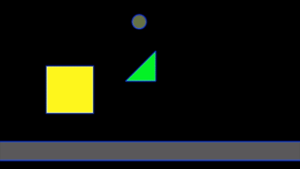

# Phaser3 Planck Physics Plugin
This plugin integrates the [Planck.js](http://piqnt.com/planck.js/) (Based on [Box2d](http://box2d.org/documentation/)) physics engine with [Phaser3](https://phaser.io/phaser3), allowing for advanced collision detection and dynamic body types. This plugin is still in development, please feel free to submit a PR or issue to help us improve this integration.



## Examples
* [Github] (https://github.com/notchris/phaser3-planck)
* [Online Sandbox](https://notchris.net/phaser3-planck/)
* [Examples Source](https://github.com/notchris/phaser3-planck/tree/master/src/scenes)

## Features
* Support for Planck bodies (Box, Circle, Polygon, Edge)
* Distance Joints, Revolute Joints, Conveyers
* Sensors & Collision Filtering
* Trajectory projection
* ...and more!

## Installation

You can install the latest version of **phaser3-planck** with your package manager.
```
npm install -S phaser3-planck
```

## Usage
### Setup

First, import the package and update your global game configuration to include the plugin.

```js
import PhaserPlanck from 'phaser3-planck'
```
```js
const  config = {
	type:  Phaser.AUTO,
    width: 640,
    height: 480,
    plugins: {
        scene: [
            { key: 'PhaserPlanck', plugin: PhaserPlanck, mapping: 'planck' }
        ]
    },
    physics: {
        planck: {
            debug: false,
            scaleFactor: 30,
            gravity: {
                x: 0,
                y: 3
            }
        }
    },
	scene: []
};

new  Phaser.Game(config);
```

### Creating Bodies

You can create different bodies in your scene using the following syntax:
```js
// Box
const box = this.planck.add.sprite(0, 0, 'boxSprite')
box.setBody('box')

// Circle
const circle = this.planck.add.sprite(0,0,'circleSprite')

// Polygon
const polygon  = this.planck.add.sprite(0, 0, 'polygonSprite')
polygon.setBody('polygon', {
    points: [[0,64],[64, 64], [64, 0]]
})

// Edge (Line)
const edge = this.planck.add.sprite(0,0,'edgeSprite')
edge.setBody('edge', {
    x1: 100,
    y1: 100,
    x2: 300,
    y2: 200
})
```

### Configuring Bodies
The central Body class that all bodies extend, provides similar API methods / properties to Planck. A list of these properties / methods can be viewed below.

**Important:**
When using native Planck methods (on sprite.body), you must pass metric values. Sprite values are converted automatically from metric to screen coordinates within their preUpdate method. We include some convenience methods (listed below) that accept screen coordinates, which are then converted to metric. These methods can be used directly on the sprite class.
___

### Sprite methods

##### .setPosition (x, y)
Updates the position of the sprite

##### .getPosition ()
Returns the position (in screen coordinates) of the sprite

##### .setRotation (radians)
Updates the rotation of the sprite (accepts radians)

##### .getRotation ()
Returns the rotation (in radians) of the sprite

##### .setStatic ()
Sets the current sprite body to static (will not be affected by gravity). Static bodies can still be transformed

##### .setDynamic ()
Sets the current sprite body to dynamic (will be affected by gravity). Bodies are dynamic by default.

##### .setSensor ()
Sets the current sprite body behavior to 'sensor'. Sensors will not collide with other bodies, but will still fire collision events

##### .isSensor ()
Returns true if the current body is a sensor

___


## Status
#### Bodies
| Type | Status |
|--|--|
| Box | ✔️ |
| Circle | ✔️ |
| Edge | ✔️ |
| Polygon | ✔️ |

#### Joints
| Type | Status |
|--|--|
| Distance | ✔️ |
| Friction |  |
| Gear |  |
| Motor |  |
| Mouse |  |
| Prismatic |  |
| Pulley |  |
| Revolute | ✔️ |
| Rope |  |
| Weld |  |
| Wheel |  |

#### Other
| Type | Status |
|--|--|
| Sensors | ✔️ |
| Conveyers | ✔️ |
| One-way Platforms |  |


## Contributing
Created by notchris & KingCosmic
Please feel free to post a PR / issue, we are looking for contributors to help with this effort. Thanks!

*You are welcome to contact me on:*
* Discord: **notchris#4207**
* IRC (Freenode): **notchris**